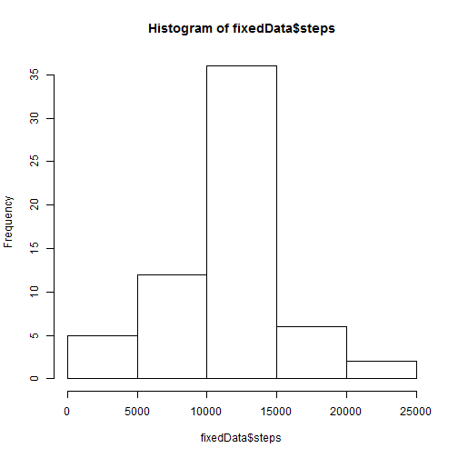
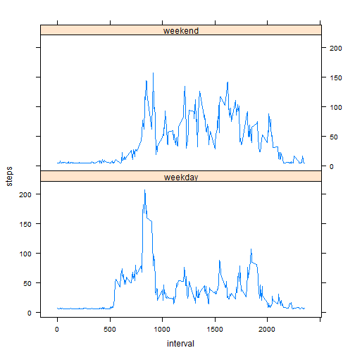

# Reproducible Research: Peer Assessment 1


## Loading and preprocessing the data

```r
unzip("activity.zip")
raw <- read.csv("activity.csv", colClasses = c("numeric", "character", "numeric"), 
    na.strings = "NA")

# remove rows with NA values
dat <- raw[!is.na(raw$steps), ]
dat <- transform(dat, date = as.Date(date, format = "%Y-%m-%d"))
```


## Mean total number of steps taken per day


```r
# total number of steps each day
stepsDate <- aggregate(steps ~ date, data = dat, sum)
hist(stepsDate$steps, main = "Historgram of total steps each day")
```

 

```r

# compute mean and median
stepsMean <- mean(stepsDate$steps)
stepsMedian <- median(stepsDate$steps)
```


Mean of total steps per day: **1.0766 &times; 10<sup>4</sup>**.

Median of total steps per day: **1.0765 &times; 10<sup>4</sup>**.

## The average daily activity pattern


```r
stepsInterval <- aggregate(steps ~ interval, dat, mean)
plot(stepsInterval$interval, stepsInterval$steps, type = "l", xlab = "Interval", 
    ylab = "Average number of steps")

# find interval with maximum steps
maxRow <- which.max(stepsInterval[, "steps"])
maxInt <- stepsInterval[maxRow, "interval"]
abline(v = maxInt, col = 4, lty = 3)
text(maxInt, 0, maxInt, pos = 4)
```

 


Maximum average **206.17** steps in
interval **835**.

## Imputing missing values


```r
missing <- sum(is.na(raw$steps))
```


There are **2304** intervals with missing values for number of steps.
Missing values will be replaced with an average number of available values.


```r
# replace missing values with an average value of available numbers
avgSteps <- mean(dat$steps)
raw[is.na(raw)] <- avgSteps

fixedData <- aggregate(steps ~ date, data = raw, sum)
hist(fixedData$steps)
```

 

```r

meanSteps <- mean(fixedData$steps)

medianSteps <- median(fixedData$steps)
```


Average number of steps after missing values fixed: **1.0766 &times; 10<sup>4</sup>**.

Median number of steps after missing values fixed: **1.0766 &times; 10<sup>4</sup>**.

## Differences in activity patterns between weekdays and weekends


```r
dat <- transform(raw, weekday = weekdays(as.Date(date, "%Y-%m-%d")))
dat$day <- as.factor(ifelse(dat$weekday == "Saturday" | dat$weekday == "Sunday", 
    "weekend", "weekday"))

stepsWd <- aggregate(steps ~ interval + day, dat, mean)

library(lattice)
xyplot(steps ~ interval | day, stepsWd, type = "l", layout = c(1, 2))
```

 

